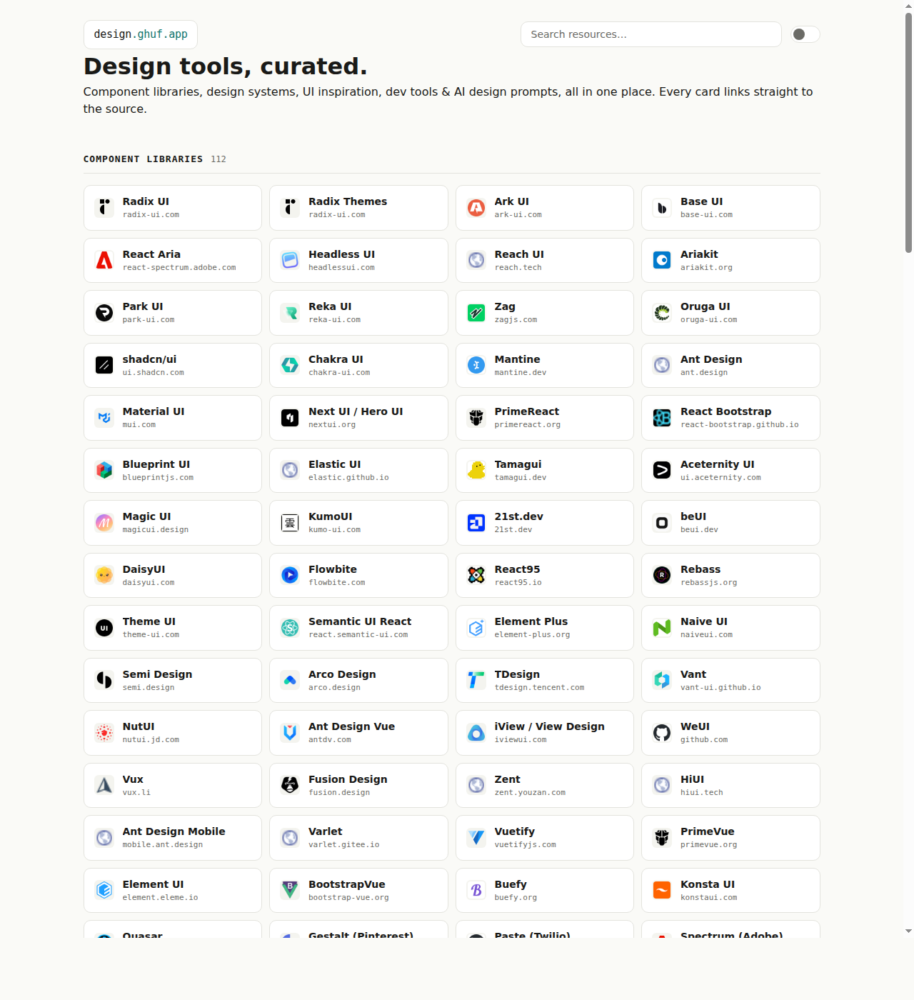

# design.ghuf.app

Curated directory of design resources, all in one place: component libraries,
design systems, UI inspiration, developer tools, and AI design prompts.
Every card links straight to the source. No accounts, no tracking, no bloat.

**Live: https://design.ghuf.app**



---

## What this is

An open, curated index of design software and references. Each entry points
directly at the resource itself, grouped by category:

| Category | Count |
|---|---|
| Component Libraries | 112 |
| Design Inspiration | 77 |
| Design Systems | 21 |
| Developer Tools | 5 |
| AI Design Prompts | 4 |

## Stack

Static site, no framework. The content source is plain Markdown, and a small
Node script turns it into the data file the page renders.

```
resources/*.md          content source (edit these)
scripts/parse.mjs       markdown parser
scripts/build.mjs       build: resources/ -> src/data.js
src/index.html          page markup
src/app.js              render, search, theme (vanilla JS)
src/styles.css          styling (dark/light, responsive)
test/parse.test.mjs     parser tests (node:test)
```

- **Fonts:** Outfit (body) + DM Mono (labels)
- **Palette:** teal accent `#0F766E` (light) / `#2dd4bf` (dark) on warm neutrals
- **No framework:** search/filter is client-side over a small JSON blob
- **Accessible:** keyboard focus, reduced motion, WCAG AA contrast

## Development

```bash
git clone https://github.com/Ghufrnainun/design-ghuf-app.git
cd design-ghuf-app

npm test        # parser tests
npm run build   # regenerate src/data.js from resources/*.md
npm run preview # serve src/ at http://127.0.0.1:8137
```

## Add a resource

Open the matching file under `resources/` and add one line:

```md
- [Name](https://example.com)
```

Optional subcategory (creates a group):

```md
## Animated

- [Motion Primitives](https://motion-primitives.com/)
```

See [CONTRIBUTING.md](CONTRIBUTING.md) for the full guide and PR flow.

## Deploy

Push to `main` → GitHub Actions (test + build) → Cloudflare Pages →
https://design.ghuf.app. Non-main branches get preview deployments.

## License

MIT. See [LICENSE](LICENSE).